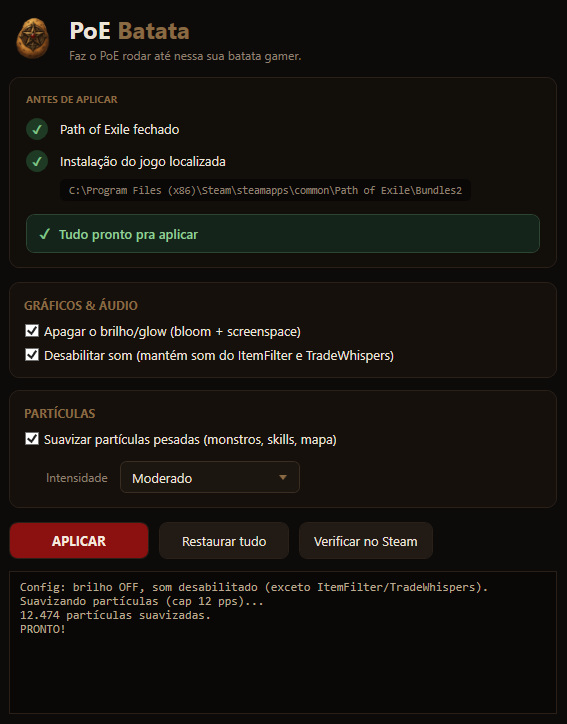

  
  <h1>PoE Batata 🥔</h1>
  
<b>Faz o PoE rodar até nessa sua batata gamer.</b> Melhoria no FPS e menos poluição visual no Path of Exile

  
<a href="../../releases/latest"><b>⬇️ BAIXAR (Releases)</b></a>

   
  

---

## O que faz

- **Apaga o brilho/glow** (bloom + screenspace).
- **Desabilita o som**, mantendo o do filtro de itens (ItemFilter) e dos sussurros de trade (TradeWhispers).
- **Suaviza partículas pesadas** de monstros, skills e mecânicas de mapa.

Faz backup automático e permite restaurar a qualquer momento as configurações padrões.

## Compatibilidade

- ✅ **Steam**
- ✅ **Cliente standalone da GGG**
- ❌ Versões de outras lojas (ex.: Epic).

> Apenas Windows.

## Como baixar e rodar

1. Em **[Releases](../../releases/latest)**, baixe o **`PoeBatata.exe`**.
2. **Feche o Path of Exile**, abra o `PoeBatata.exe`, marque as opções e clique **Aplicar**.
3. Abra o jogo.

Para desfazer: botão **Restaurar tudo**.

## ⚠️ Aviso

Software gratuito de código fechado. Sem garantias.
